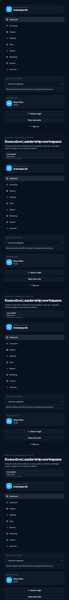
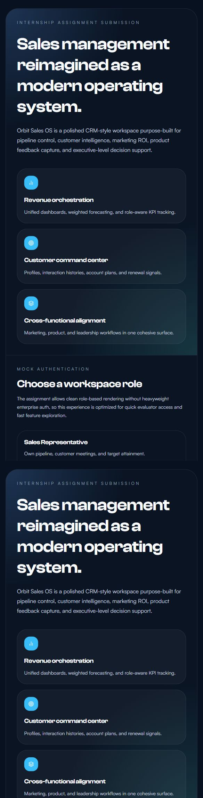
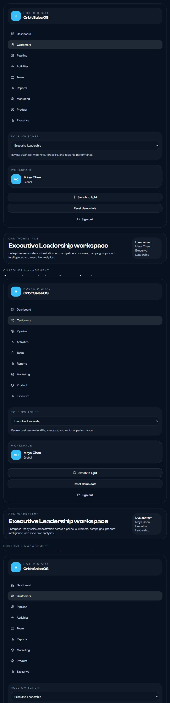
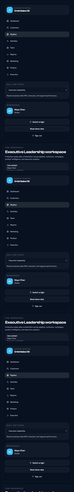
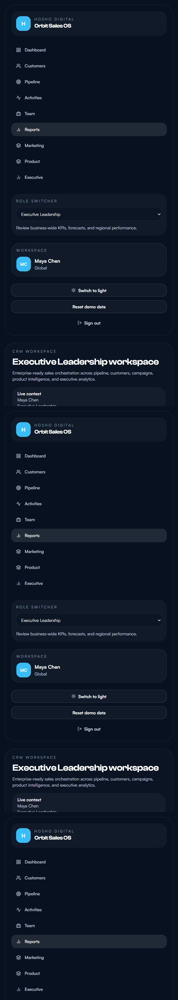
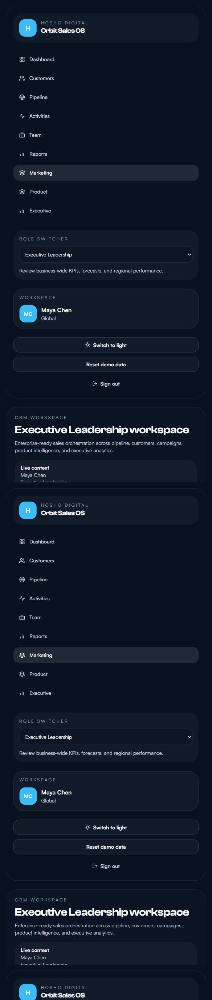
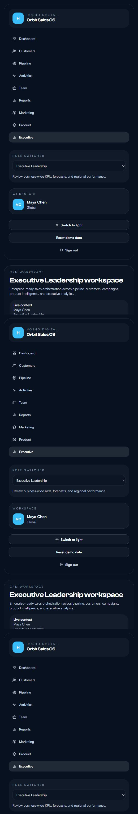

# Orbit Sales OS - HOSHO DIGITAL

Orbit Sales OS is a polished Sales Management CRM built for the HOSHŌ Digital screening exercise. The project turns the PDF user stories into a premium, locally runnable SaaS-style workspace with role-based navigation, rich dashboards, realistic business data, and clean evaluator onboarding.



## Evaluator Quick Start

```bash
npm install
npm run dev
```

Open the local URL shown by Vite and start exploring immediately. No backend, database setup, paid service, or environment configuration is required for core usage.

## Assignment Coverage

The application is designed directly from the attached PDF:

- Sales Representative: customer contacts, activity logging, pipeline management, targets, and performance tracking
- Sales Manager: team dashboard, territory assignment, discount approvals, and forecasting visibility
- Account Manager: customer history, satisfaction metrics, account planning, and renewal reminders
- Marketing Team: campaign ROI, lead sharing, segments, and sales-content collaboration signals
- Product Manager: product updates, documentation, feature requests, and customer feedback capture
- Executive Leadership: high-level KPI dashboards, regional analytics, win/loss insight, and revenue forecasts

Detailed traceability is documented in [docs/USER_STORY_TRACEABILITY.md](docs/USER_STORY_TRACEABILITY.md).

## What Makes This Submission Strong

- Premium CRM-style UI with multiple dashboard themes
- Clean mock authentication with role switching for fast evaluation
- Responsive dashboards with KPI cards, line charts, bar charts, donut visuals, and funnel analytics
- Customer records with interaction history and profile drill-down
- Opportunities and stage-based pipeline tracking
- Calls, meetings, notes, and follow-up activity timelines
- Team performance views, territory ownership, and discount approval flows
- Marketing ROI, product feedback, and executive intelligence modules
- Local persistence so evaluators can interact with the app like a real workspace
- Enterprise-style polish including audit logs, idle logout, error boundaries, form validation, and safe markdown rendering

## Screens At A Glance

| Screen | Preview |
| --- | --- |
| Login |  |
| Dashboard |  |
| Customers |  |
| Pipeline |  |
| Reports |  |
| Marketing |  |
| Executive |  |

## Submission Deliverables

- Working application: this repository
- Solution document: [docs/Hosho_Sales_CRM_Solution_Document.docx](docs/Hosho_Sales_CRM_Solution_Document.docx)
- ERD source: [docs/Hosho_Sales_CRM_ERD.drawio](docs/Hosho_Sales_CRM_ERD.drawio)
- ERD image: [docs/Hosho_Sales_CRM_ERD.png](docs/Hosho_Sales_CRM_ERD.png)
- Architecture visual: [docs/Hosho_Sales_CRM_Architecture.png](docs/Hosho_Sales_CRM_Architecture.png)
- Power BI sample dataset: [power-bi/Hosho_Sales_CRM_PowerBI_Dataset.xlsx](power-bi/Hosho_Sales_CRM_PowerBI_Dataset.xlsx)
- Power BI guide: [docs/POWER_BI_GUIDE.md](docs/POWER_BI_GUIDE.md)
- Submission index: [docs/SUBMISSION_INDEX.md](docs/SUBMISSION_INDEX.md)
- Evaluator walkthrough: [docs/EVALUATOR_GUIDE.md](docs/EVALUATOR_GUIDE.md)
- User story traceability: [docs/USER_STORY_TRACEABILITY.md](docs/USER_STORY_TRACEABILITY.md)

## Recommended Evaluation Flow

1. Start at `/login` and test a few roles such as `Sales Manager`, `Account Manager`, and `Executive Leadership`.
2. Review the `Performance cockpit` dashboard and switch themes from the sidebar to see the premium shell behavior.
3. Open `Customers` to inspect profiles, interaction history, health, satisfaction, and renewal tracking.
4. Open `Pipeline`, `Activities`, and `Team` to review the operational sales workflows.
5. Open `Marketing`, `Product`, `Reports`, and `Executive` for cross-functional coverage.
6. Review the documents in `docs/` and the Power BI workbook in `power-bi/`.

## Local Run And Build

Development:

```bash
npm run dev
```

Production build:

```bash
npm run build
```

Test run:

```bash
npm run test:run
```

Preview production build:

```bash
npm run preview
```

## Architecture Overview

- `src/app/` contains routing, protected workspace logic, and global crash handling
- `src/context/AppContext.jsx` manages seeded CRM state, session, theme selection, local persistence, and audit events
- `src/data/mockData.js` provides realistic business data across customers, opportunities, activities, campaigns, renewals, territories, and feedback
- `src/pages/` maps each business capability into focused route-level workspaces
- `src/components/charts/` contains reusable chart modules for dashboards and reports
- `src/components/common/` contains shared UI primitives, SEO helpers, markdown safety, loaders, and form controls
- `src/utils/` contains formatting, audit helpers, validation, metrics, storage, and monitoring configuration

## Enterprise-Style Frontend Features

- `react-helmet-async` based route SEO
- `react-idle-timer` secure auto logout after inactivity
- `react-error-boundary` crash containment and recovery
- `@sentry/react` optional error monitoring bootstrap
- `yup` schema validation for forms
- `react-markdown` plus `rehype-sanitize` for safe rich text rendering
- `loglevel` powered frontend audit logging
- Multi-theme design system with persistent theme selection

## Power BI Support

The repository includes a Power BI-ready Excel workbook with structured data for executive, pipeline, marketing, customer health, and product feedback dashboards.

- Dataset: [power-bi/Hosho_Sales_CRM_PowerBI_Dataset.xlsx](power-bi/Hosho_Sales_CRM_PowerBI_Dataset.xlsx)
- Guide: [docs/POWER_BI_GUIDE.md](docs/POWER_BI_GUIDE.md)

Import the workbook in Power BI Desktop using `Import` mode, then follow the recommended relationships and DAX notes from the guide.

## Deployment

`vercel.json` is included so the project can be deployed to Vercel as a single-page application without additional routing work.

Optional environment variables:

- `VITE_SENTRY_DSN` enables Sentry monitoring when provided

## Project Structure

```text
src/
  app/
  components/
    charts/
    common/
    layout/
  context/
  data/
  pages/
  styles/
  test/
  utils/
docs/
power-bi/
screenshots/
```

## Notes

- The project is intentionally frontend-first to maximize local simplicity and reviewability.
- Core functionality works without any cloud dependency.
- All business data is realistic mock data persisted in browser storage for a more authentic demo.
