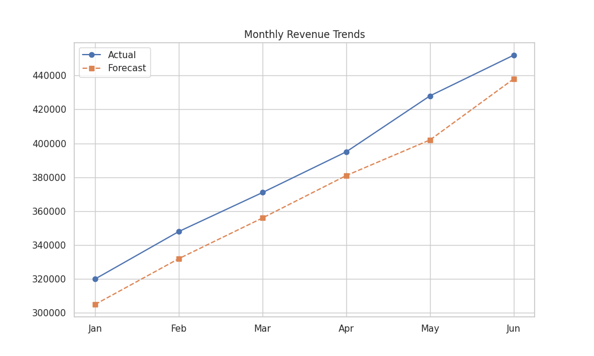
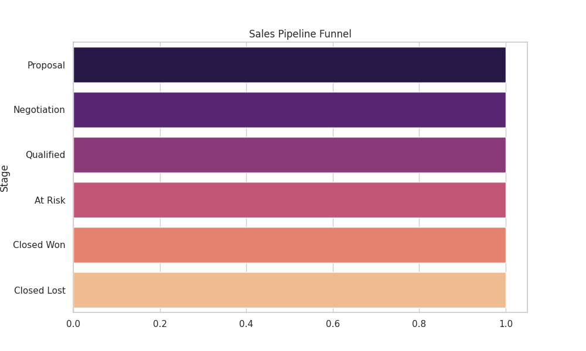
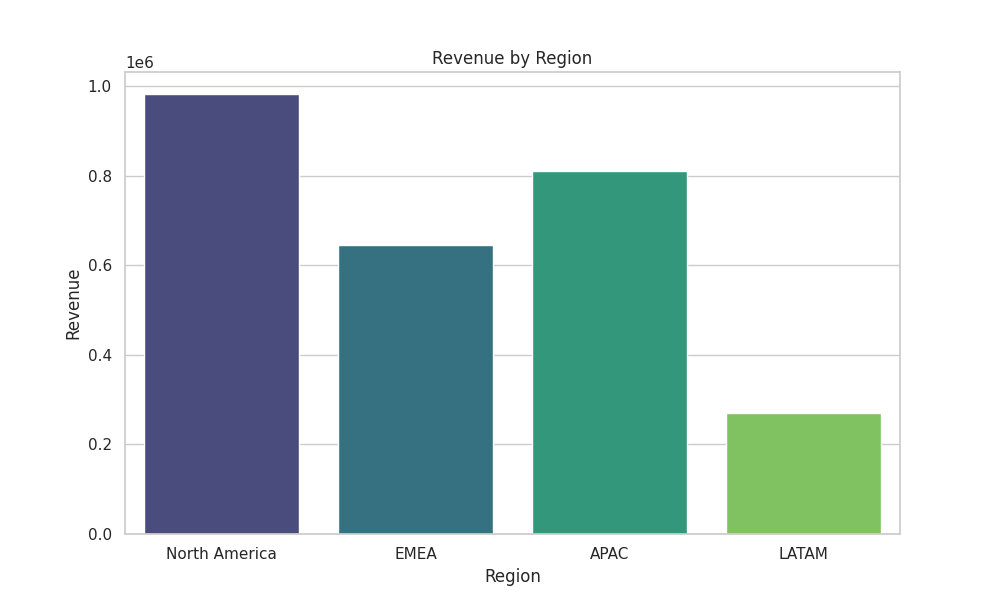
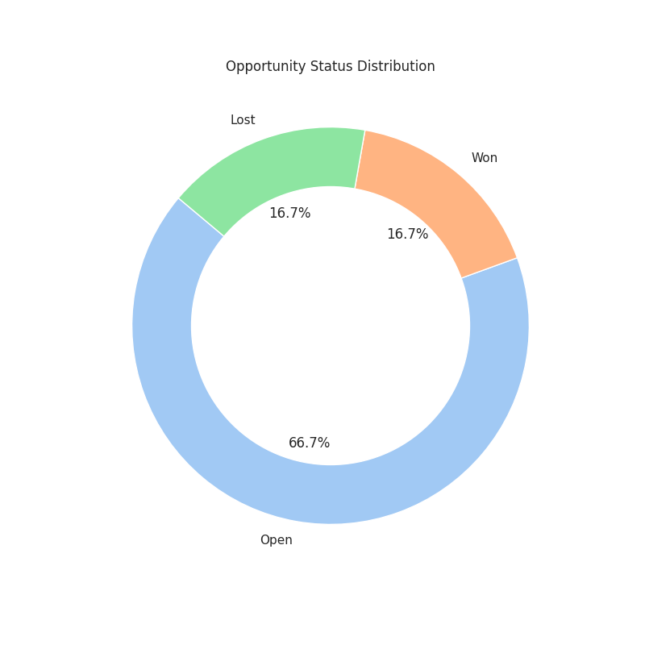

# Power BI Implementation Guide - Orbit Sales OS

This guide provides step-by-step instructions to recreate the professional dashboards for the Hosho Digital Sales CRM using the provided dataset.

## 1. Data Source Setup

1. Open **Power BI Desktop**.
2. Click **Get Data** > **Excel workbook**.
3. Select `power-bi/Hosho_Sales_CRM_PowerBI_Dataset.xlsx`.
4. In the Navigator, select all sheets: `Customers`, `Opportunities`, `Activities`, `Campaigns`, `RevenueMonthly`, `RegionalPerformance`, `FeatureRequests`.
5. Ensure **Import** mode is selected (as per project requirements).

## 2. Data Modeling (Relationships)

Go to the **Model view** and verify/create the following relationships (all 1:Many):

- `Customers[CustomerID]` → `Opportunities[CustomerID]`
- `Customers[CustomerID]` → `Activities[CustomerID]`
- `Customers[CustomerID]` → `FeatureRequests[CustomerID]`

## 3. Key Measures (DAX)

Create a new table named `_Measures` and add the following DAX formulas:

```dax
Open Pipeline = 
CALCULATE(SUM(Opportunities[Value]), Opportunities[Status] = "Open")

Weighted Forecast = 
SUMX(
    FILTER(Opportunities, Opportunities[Status] = "Open"),
    Opportunities[Value] * DIVIDE(Opportunities[Probability], 100)
)

Booked Revenue = 
CALCULATE(SUM(Opportunities[Value]), Opportunities[Status] = "Won")

Win Rate % = 
DIVIDE(
    CALCULATE(COUNT(Opportunities[OpportunityID]), Opportunities[Status] = "Won"),
    COUNT(Opportunities[OpportunityID])
)

Campaign ROI = 
DIVIDE(SUM(Campaigns[InfluencedRevenue]), SUM(Campaigns[Spend]))
```

## 4. Dashboard Pages Construction

### Page 1: Executive Overview
- **KPI Cards**: Display `Booked Revenue`, `Weighted Forecast`, `Open Pipeline`, and `Win Rate %`.
- **Revenue Trend**: Line chart using `RevenueMonthly[Month]` (Axis) and `ActualRevenue` vs `ForecastRevenue` (Values).
- **Regional Performance**: Clustered bar chart using `RegionalPerformance[Region]` (Axis) and `Revenue` (Values).
- **Opportunity Split**: Donut chart using `Opportunities[Status]` (Legend) and `OpportunityID` (Count).

### Page 2: Sales Pipeline
- **Pipeline Funnel**: Funnel visual using `Opportunities[Stage]` (Group) and `Value` (Values).
- **Top Deals Table**: Table visual showing `OpportunityName`, `AccountName`, `Value`, `Probability`, and `ExpectedCloseDate`.
- **Slicer**: Add a slicer for `RegionalPerformance[Region]` to filter the entire report.

### Page 3: Customer & Product Insights
- **Customer Health Matrix**: Matrix visual with `CustomerName` (Rows), and `HealthScore`, `Satisfaction`, `AnnualValue` (Values).
- **Feature Requests**: Bar chart showing `FeatureRequests[Category]` and count of `RequestID`.
- **Campaign Performance**: Scatter chart with `Campaigns[Spend]` (X-Axis) and `InfluencedRevenue` (Y-Axis).

## 5. Visual Reference

The following visuals represent the expected output in Power BI:

| Executive Overview | Pipeline Funnel |
|-------------------|-----------------|
|  |  |
|  |  |

---
*Note: This dataset is pre-normalized and ready for immediate import without further cleaning.*
